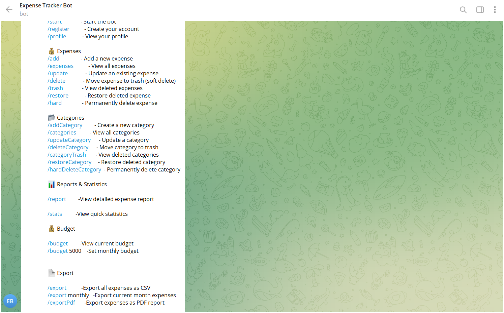
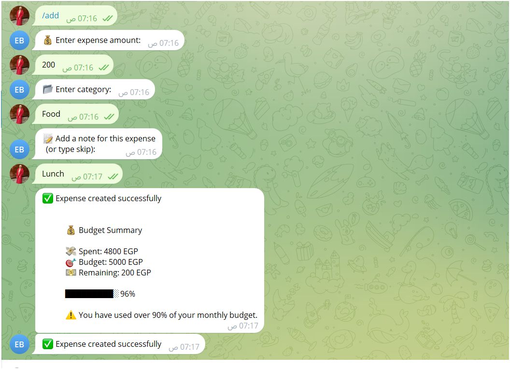
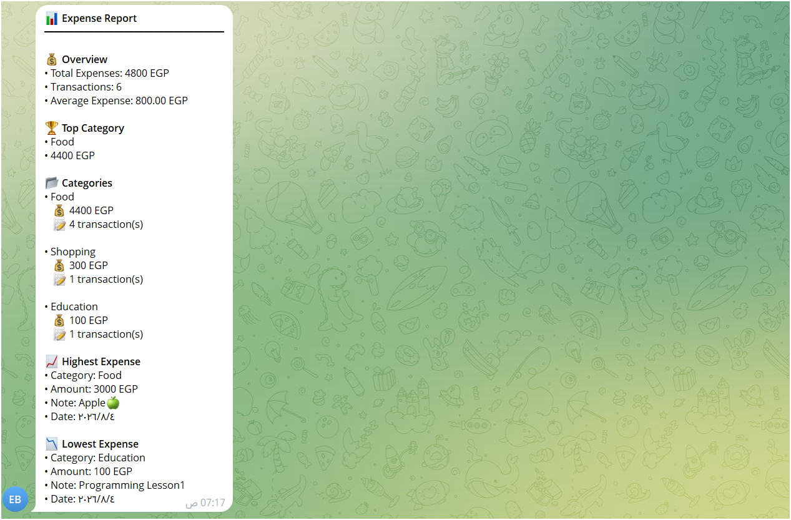
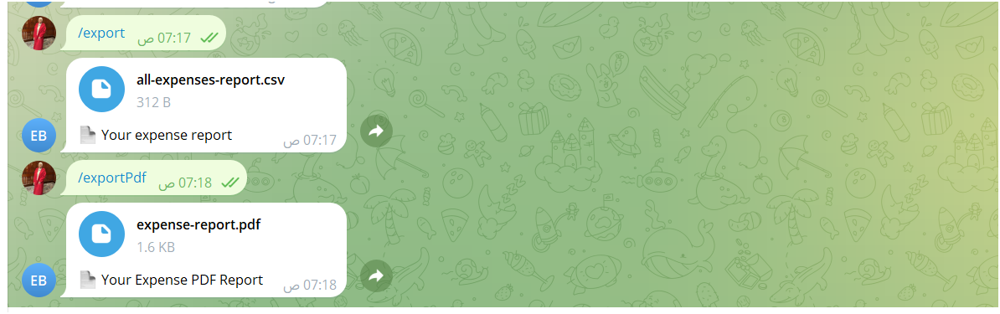

# 🤖 Expense Tracker Telegram Bot

A smart **Telegram Expense Tracker Bot** built with **NestJS, Telegraf, MongoDB**, designed to help users manage daily expenses, track budgets, generate financial reports, and export expense data.

---

# 🚀 Features

## 👤 User Management

* User registration through Telegram
* Profile management
* Currency support

---

# 💰 Expense Management

Users can manage their expenses through an interactive conversation flow.

Features:

* Add expenses
* View all expenses
* Update expenses
* Soft delete expenses
* View deleted expenses
* Restore expenses
* Permanently delete expenses

### Expense Data:

* Amount
* Category
* Note
* Date
* Currency

---

# 📂 Category Management

Complete category lifecycle management:

* Create custom categories
* View categories
* Update categories
* Soft delete categories
* Restore categories
* Permanently delete categories

---

# 📊 Reports & Statistics

Generate detailed expense analytics:

* Total expenses
* Total transactions
* Average expense
* Highest expense
* Lowest expense
* Expenses grouped by category
* Top spending category

Example:

```
📊 Expense Report

💰 Total Expenses: 600 EGP
📝 Transactions: 4

💵 Average Expense: 200 EGP

📂 Categories:
Food
Shopping
Education

📈 Highest Expense
Shopping - 300 EGP

📉 Lowest Expense
Education - 100 EGP
```

---

# 💰 Budget Tracking

Users can set and monitor a monthly budget.

Example:

```
/budget 5000
```

The bot provides:

* Current spending
* Monthly budget limit
* Usage percentage
* Warning alerts when approaching or exceeding the limit

---

# 📄 Export System

Export expense data in different formats.

## CSV Export

Export all expenses:

```
/export
```

## Monthly Export

Export current month expenses only:

```
/export monthly
```

## PDF Report

Generate a PDF expense report:

```
/export-pdf
```

---

# 📸 Screenshots

## Help Menu



## Add Expense Flow



## Expense Report




## Export Reports



---

# 📚 Bot Commands

## 👤 Account

```
/start
/register
/profile
```

---

## 💰 Expenses

```
/add
/expenses
/update
/delete
/trash
/restore
/hard
```

---

## 📂 Categories

```
/addCategory
/categories
/updateCategory
/deleteCategory
/categoryTrash
/restoreCategory
/hardDeleteCategory
```

---

## 📊 Reports

```
/report
/stats
```

---

## 💰 Budget

```
/budget
/budget 5000
```

---

## 📄 Export

```
/export
/export monthly
/export-pdf
```

---

# 🛠 Tech Stack

## Backend

* NestJS
* TypeScript
* Telegraf

## Database

* MongoDB
* Mongoose

## Cache & Session

* Redis

## Libraries

* json2csv
* pdfkit

---

# 🏗 Project Architecture

```
src
│
├── modules
│   ├── users
│   ├── expenses
│   ├── categories
│   ├── reports
│   ├── export
│   ├── conversation
│   └── telegram
│
├── common
│   ├── repository
│   ├── enums
│   ├── interfaces
│   └── messages
│
└── main.ts
```

---

# ⚙️ Installation

Clone repository:

```bash
git clone <repository-url>
```

Install dependencies:

```bash
npm install
```

Create `.env` file:

```env
MONGODB_URI=
REDIS_HOST=
REDIS_PORT=
TELEGRAM_BOT_TOKEN=
```

Run development:

```bash
npm run start:dev
```

Build:

```bash
npm run build
```

Run production:

```bash
npm run start:prod
```

---

# 🔮 Future Improvements

Planned features:

* 📷 OCR Receipt Scanner
* 🎤 Voice Expense Creation
* 🤖 AI Expense Insights
* 📈 Expense Prediction
* 🔔 Smart Notifications
* 📊 Advanced Analytics Dashboard

---

# 👩‍💻 Author

**Rahma Salama**

Backend Developer

NestJS | Node.js | MongoDB | Backend Systems
