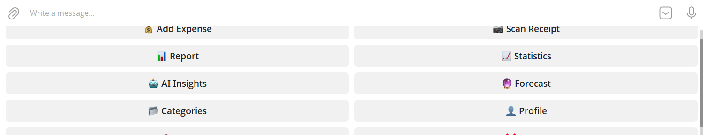
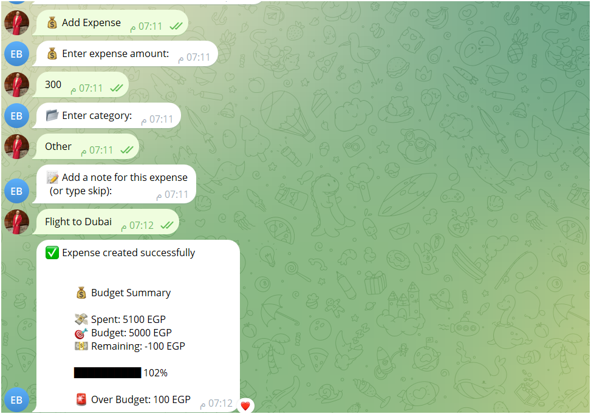
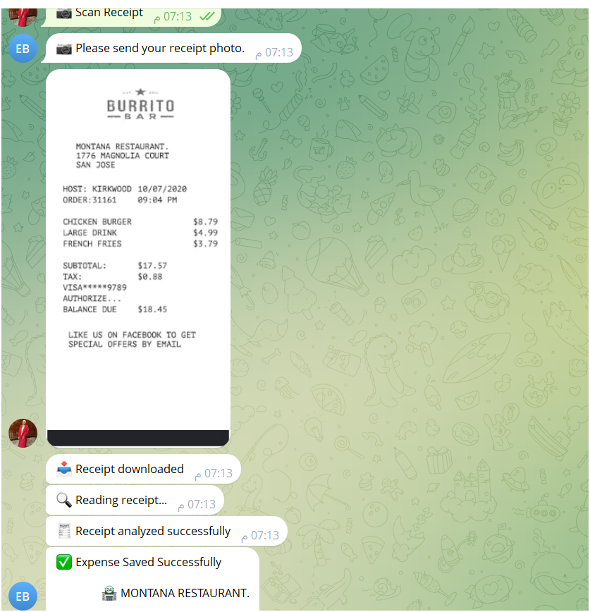
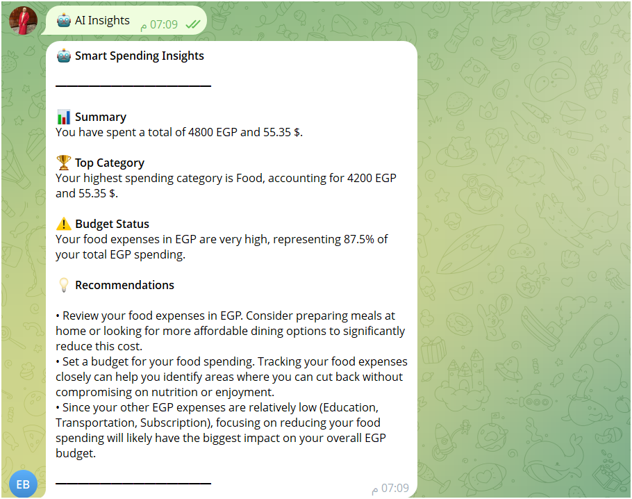
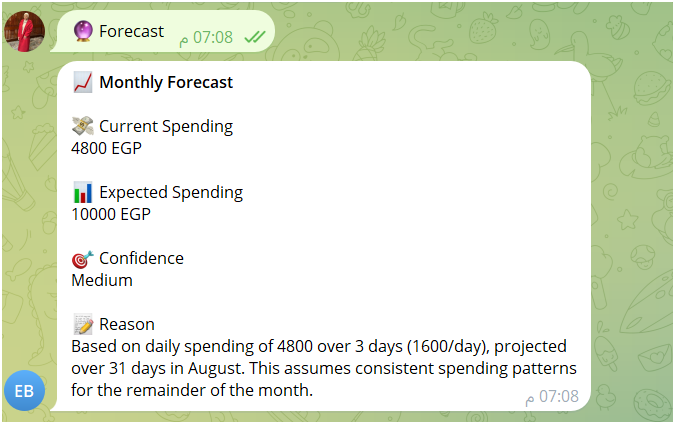
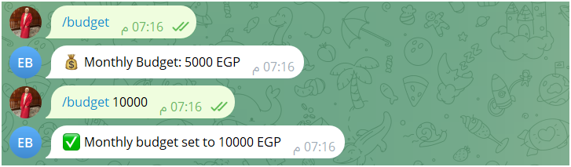
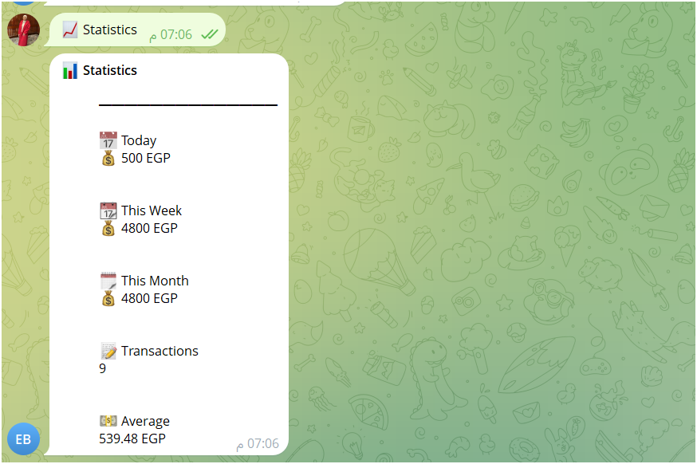

# 🤖 AI-Powered Expense Tracker Telegram Bot

A smart **AI-powered Telegram Expense Tracker Bot** built with **NestJS, Telegraf, MongoDB, Redis, OpenRouter AI, and OCR** to help users manage expenses, track budgets, scan receipts, generate financial reports, and receive AI-powered spending insights.

---

# 🚀 Features

## 👤 User Management

- User Registration
- Profile Management
- Preferred Currency
- Welcome Back Detection

---

# 💰 Expense Management

Manage expenses through an interactive Telegram conversation.

### Features

- Add Expense
- View Expenses
- Update Expense
- Soft Delete Expense
- Restore Expense
- Permanently Delete Expense

### Expense Information

- Amount
- Category
- Merchant
- Note
- Currency
- Date

---

# 📂 Category Management

Complete category lifecycle management.

- Create Category
- View Categories
- Update Category
- Soft Delete Category
- Restore Category
- Permanently Delete Category

---

# 📊 Reports & Statistics

Generate detailed financial reports.

Features include:

- Total Expenses
- Total Transactions
- Average Expense
- Highest Expense
- Lowest Expense
- Expenses by Category
- Top Spending Category

---

# 💰 Budget Tracking

Set and monitor monthly budgets.

Example:

```bash
/budget 5000
```

The bot provides:

- Current Spending
- Remaining Budget
- Budget Usage Percentage
- Progress Bar
- Over Budget Alerts

Example

```
💰 Budget Summary

💸 Spent: 5100 EGP
🎯 Budget: 5000 EGP
💵 Remaining: -100 EGP

██████████ 102%

🚨 Over Budget: 100 EGP
```

---

# 🤖 AI Features

## 📷 AI Receipt Scanner (OCR)

Upload a receipt image and the bot automatically:

- Extracts text using OCR
- Detects Merchant
- Detects Amount
- Detects Category
- Detects Currency
- Detects Purchase Date
- Generates Expense Note
- Shows a Preview Before Saving

Example

```
📷 Receipt Detected

Merchant: Starbucks

Amount: 180 EGP

Category: Food

Date: 2026-08-01

Save Expense?
```

---

## 🧠 Smart Spending Insights

AI analyzes user spending and provides:

- Spending Summary
- Top Spending Category
- Spending Warning
- Personalized Saving Tips

Example

```
🤖 Smart Spending Insights

📊 Summary

You spent 4800 EGP this month.

🏆 Top Category

Food

⚠️ Warning

Food expenses represent most of your spending.

💡 Tips

• Reduce restaurant visits.
• Cook more meals at home.
• Set a weekly food budget.
```

---

## 🔮 Monthly Expense Forecast

Predict expected monthly spending using AI.

Returns:

- Current Spending
- Expected Spending
- Confidence Level
- AI Explanation

Example

```
📈 Monthly Forecast

💸 Current Spending
4800 EGP

📊 Expected Spending
10000 EGP

🎯 Confidence
Medium

📝 Reason

Based on your spending trend, your monthly expenses are expected to increase if the current pattern continues.
```

---

# 📄 Export Reports

Export expense data in different formats.

## CSV

```bash
/export
```

## Monthly CSV

```bash
/export monthly
```

## PDF Report

```bash
/exportPdf
```

---

# 📸 Screenshots

## Start Menu



---

## Help Menu


---

## Add Expense



---

## Receipt Scanner



---

## AI Insights



---

## Monthly Forecast



---

## Budget



---

## Statistics



---

## Expense Report


---

## Export


---

# 📚 Bot Commands

## 👤 Account

```text
/start
/register
/profile
```

---

## 💰 Expenses

```text
/add
/expenses
/update
/delete
/trash
/restore
/hard
```

---

## 📂 Categories

```text
/addCategory
/categories
/updateCategory
/deleteCategory
/categoryTrash
/restoreCategory
/hardDeleteCategory
```

---

## 📊 Reports

```text
/report
/stats
```

---

## 💰 Budget

```text
/budget
/budget 5000
```

---

## 🤖 AI

```text
/scan
/insights
/forecast
```

---

## 📄 Export

```text
/export
/export monthly
/exportPdf
```

---

# 🛠 Tech Stack

## Backend

- NestJS
- TypeScript
- Node.js
- Telegraf

## Database

- MongoDB
- Mongoose

## Cache & Session

- Redis (Upstash Redis)

## AI

- OpenRouter API
- Google Gemini 2.5 Flash

## OCR

- OCR Text Recognition

## Export

- PDFKit
- json2csv

---

# 🏗 Project Architecture

```text
src
│
├── modules
│   ├── ai
│   │   ├── ai.service.ts
│   │   ├── ocr.service.ts
│   │   └── voice.service.ts
│   │
│   ├── telegram
│   ├── users
│   ├── expenses
│   ├── categories
│   ├── reports
│   ├── export
│   ├── conversation
│   └── redis
│
├── common
│   ├── repository
│   ├── interfaces
│   ├── enums
│   └── messages
│
└── main.ts
```

---

# ⚙️ Installation

Clone the repository

```bash
git clone <repository-url>
```

Install dependencies

```bash
npm install
```

Create a `.env` file

```env
MONGODB_URI=

BOT_TOKEN=

REDIS_URL=

OPENROUTER_API_KEY=
```

Run Development

```bash
npm run start:dev
```

Build

```bash
npm run build
```

Run Production

```bash
npm run start:prod
```

---

# 🔮 Future Improvements

- 🎤 Voice Expense Recording
- 🔔 Smart Budget Notifications
- 📅 Recurring Expenses
- 📈 Advanced Dashboard
- 🌍 Multi-language Support
- ☁️ Cloud Deployment

---

# 👩‍💻 Author

**Rahma Salama**

Backend Developer

**NestJS • Node.js • MongoDB • Redis • OpenRouter AI • Telegram Bots**